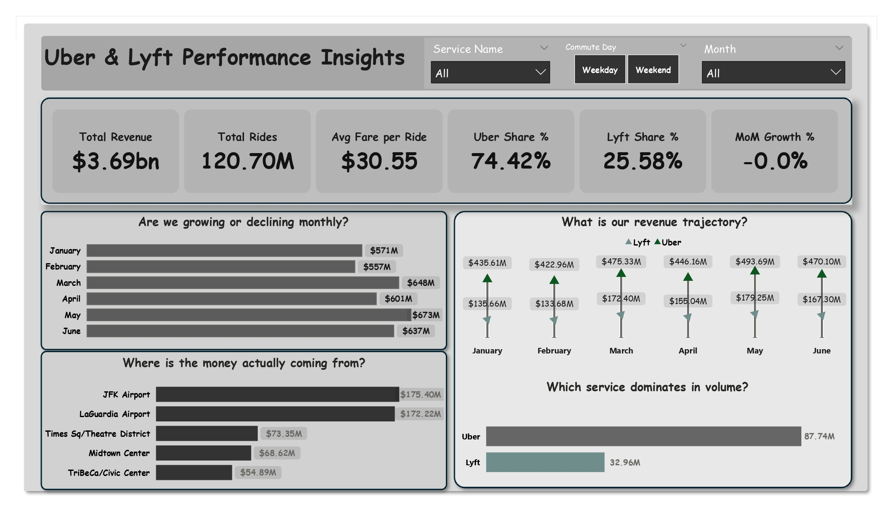

# 🚕 NYC Rideshare Performance Analysis (H1 2025)

**Analyzing 120M+ Uber & Lyft Trips to Drive Strategic Decisions**


---

## 📊 Executive Dashboard


*Interactive Power BI dashboard showing revenue trends, market share, and geographic performance*

> **Note:** Full interactive dashboard available in `rideshare dashboard.pdf`

---

## 🎯 Business Problem

NYC rideshare companies needed answers to critical questions:
- **Revenue Growth:** Are we growing or declining month-over-month?
- **Market Share:** Who's winning - Uber or Lyft?
- **Operational Efficiency:** When and where is demand highest?
- **Geographic Opportunities:** Which zones are underperforming but have potential?

**Challenge:** Raw data contained 120M+ messy records requiring extensive cleaning, aggregation, and transformation before analysis could begin.

---

## 🔑 Key Findings

### 💰 Revenue Performance
- **Total Revenue:** $3.69 billion across 120.7M trips
- **Peak Month:** May 2025 ($673M) with 16% growth from March
- **Seasonal Pattern:** Winter decline in Feb (-2.6%), strong spring recovery (+16%)
- **Premium Growth:** High-value trips ($50+) surged 34% from January to June

### 📈 Market Dynamics
- **Uber Dominance:** 72.7% market share (trips), 74.4% (revenue)
- **Efficiency Leader:** Uber generates $0.19 more per mile than Lyft
- **Tipping Advantage:** Lyft passengers tip 25% more (4.45% vs 3.55%)

### ⏰ Operational Insights
- **Peak Days:** Saturday (20M trips), Friday (19M trips)
- **Rush Hours:** 5-7 PM weekdays, 11 PM-1 AM weekends
- **Average Trip:** 5 miles, 19.5 minutes, $26.61 fare

### 🗺️ Geographic Performance
- **Top Revenue Zones:** JFK Airport ($175M), LaGuardia ($172M), Times Square ($73M)
- **Fastest Growing:** Flushing Meadows (+707%), Willets Point (+376%)
- **Underserved Gems:** Newark Airport ($68 avg fare), Financial District South ($40 avg fare)

---

## 💡 Strategic Recommendations

### 1. Premium Service Expansion
**Finding:** Premium trips grew 34% (Jan→June), outpacing standard trip growth.

**Action:** 
- Launch dedicated premium tier for airport/long-distance routes
- Increase driver incentives during May-June peak season
- Target marketing to business travelers and tourists

### 2. Peak Demand Optimization
**Finding:** 5-7 PM weekdays show 40% higher volume than off-peak hours.

**Action:**
- Implement dynamic pricing algorithms for identified peak windows
- Optimize driver allocation using demand heatmaps
- Deploy surge pricing in Midtown Manhattan and airports during rush hours

### 3. Geographic Market Penetration
**Finding:** Outer borough zones show 300%+ growth but low absolute volume.

**Action:**
- Launch targeted campaigns in high-growth zones (Flushing Meadows, Breezy Point)
- Partner with local attractions/venues for ride discounts
- Expand service hours in Staten Island (consistently high avg fares $25-28)

### 4. Competitive Intelligence
**Finding:** Lyft customers tip 25% more despite Uber's superior efficiency metrics.

**Action:**
- Study Lyft's in-app tipping interface and prompts
- A/B test tip suggestion amounts and timing
- Investigate service quality factors driving higher Lyft tip rates

---

## 🛠️ Technical Architecture

### Data Pipeline
```
NYC Open Data (Parquet) → Python ETL → PostgreSQL → Power BI Dashboard
     126M raw rows      →  Cleaning  →  120M clean →  5M aggregated
```

### Tech Stack
| Component | Technology |
|-----------|-----------|
| **Data Source** | NYC TLC Open Data Portal (FHVHV Trip Records) |
| **Extraction** | Python 3.11 (pandas, requests, sqlalchemy) |
| **Storage** | PostgreSQL 16 |
| **Transformation** | SQL (views, aggregations, window functions) |
| **Visualization** | Microsoft Power BI Desktop |
| **Version Control** | Git/GitHub |

### Database Schema
**Fact Table:** `pbi_master_fact` (5-10M aggregated rows)
- Dimensions: date, hour, day_of_week, service, pickup/dropoff zones, distance category
- Metrics: trips, revenue, fares, tips, tolls, miles, minutes, shared rides

**Dimension Tables:**
- `dim_date` - Calendar lookup (365 days)
- `dim_zones` - NYC taxi zones with borough mapping (265 zones)
- `dim_services` - Service providers (Uber, Lyft)

---

## 📂 Repository Structure

```
sql-analysis/
│
├── analysis/
│   ├── extraction.py                       # Download parquet files from NYC API
│   ├── data_inspection_01.sql              # Data quality checks (120+ queries)
│   ├── cleaning_logic_02.sql               # Data cleaning view creation
│   ├── clean_rides_03.sql                  # Clean rides view
│   ├── business_analytics_views.sql        # 15 analytical views
│   ├── insights_questions.sql              # Business question queries
│   ├── NYC Rideshare Performance Analysis Project.pdf  # Full project report
│   ├── rideshare dashboard.pdf             # Power BI dashboard export
│   └── xxx.csv                             # Sample data
│
├── .gitignore
├── .python-version
├── main.py
└── README.md                               # This file
```

---

## 📊 Dashboard Features

### Executive Overview Dashboard
**4 Key Visualizations:**

1. **Revenue Trend Line Chart**
   - Daily revenue trajectory (Jan-June)
   - Service comparison (Uber vs Lyft)
   - Identifies seasonal patterns and growth anomalies

2. **Market Share Bar Chart**
   - Total trips by service provider
   - Percentage distribution visualization
   - Clear dominance indicators

3. **Monthly Revenue Comparison**
   - Clustered column chart by month
   - Month-over-month growth tracking
   - Peak performance identification

4. **Top 5 Pickup Zones**
   - Horizontal bar chart ranked by revenue
   - Geographic revenue concentration analysis
   - Airport vs urban zone comparison

**Interactive Filters:**
- Date range selector
- Service provider filter (Uber/Lyft/Both)
- Zone-level filtering

**KPI Cards:**
- Total Revenue: $3.69B
- Total Trips: 120.7M
- Average Fare: $26.61
- Month-over-Month Growth %
- Market Share by Provider

---

## 🔍 Data Quality Metrics

| Metric | Result |
|--------|--------|
| **Raw Records** | 126,000,000 |
| **Valid Records After Cleaning** | 120,701,625 (95.8%) |
| **Records Removed** | 5,298,375 |
| **Duplicates** | 7 (negligible) |
| **Date Range Compliance** | 100% |
| **Financial Validity** | 100% (all fares > $0) |
| **Distance Validity** | 100% (all miles > 0) |

### Data Cleaning Rules Applied:
- ❌ Removed trips outside Jan-June 2025 (575K records)
- ❌ Removed zero/negative fares (111K records)
- ❌ Removed zero/negative distances (15K records)
- ❌ Removed invalid timestamps (dropoff before pickup)
- ❌ Removed trips with missing locations
- ✅ Standardized service names (Uber, Lyft)
- ✅ Calculated total revenue (fare + tips + tolls + fees)
- ✅ Converted durations to minutes for readability

---

## 🚀 How to Reproduce This Project

### Prerequisites
- PostgreSQL 16+ installed
- Python 3.11+ with pip
- Power BI Desktop (optional, dashboard PDF provided)
- 50GB+ free disk space

### Step 1: Clone Repository
```bash
git clone https://github.com/yourusername/sql-analysis.git
cd sql-analysis
```

### Step 2: Install Python Dependencies
```bash
pip install pandas sqlalchemy psycopg2-binary python-dotenv pyarrow requests
```

### Step 3: Configure Database
Create a `.env` file:
```
DB_HOST=localhost
DB_PORT=5432
DB_NAME=nyc_rides_db
DB_USER=postgres
DB_PASSWORD=your_password
BASE_URL=https://d37ci6vzurychx.cloudfront.net/trip-data
YEAR=2025
START_MONTH=1
END_MONTH=6
```

### Step 4: Extract Data
```bash
cd analysis
python extraction.py
# Downloads 6 months of parquet files (~3GB)
# Loads into PostgreSQL (takes 1-2 hours)
```

### Step 5: Run Data Pipeline
```sql
-- Execute in PostgreSQL (in order):
\i data_inspection_01.sql
\i cleaning_logic_02.sql
\i clean_rides_03.sql
\i business_analytics_views.sql
\i insights_questions.sql
```

### Step 6: View Results
- Check `NYC Rideshare Performance Analysis Project.pdf` for full report
- Check `rideshare dashboard.pdf` for dashboard visuals
- Or connect Power BI Desktop to your PostgreSQL database

---

## 📈 Sample Queries

### Top 10 Revenue Zones
```sql
SELECT 
    dz.zone,
    dz.borough,
    SUM(pmf.total_revenue) as revenue,
    SUM(pmf.total_trips) as trips
FROM pbi_master_fact pmf
JOIN dim_zones dz ON pmf.pickup_location_id = dz.location_id
GROUP BY dz.zone, dz.borough
ORDER BY revenue DESC
LIMIT 10;
```

### Month-over-Month Growth
```sql
WITH monthly AS (
    SELECT 
        DATE_TRUNC('month', ride_date) as month,
        SUM(total_revenue) as revenue
    FROM pbi_master_fact
    GROUP BY 1
)
SELECT 
    TO_CHAR(month, 'YYYY-MM') as month,
    revenue,
    LAG(revenue) OVER (ORDER BY month) as prev_month,
    ROUND(((revenue - LAG(revenue) OVER (ORDER BY month)) / 
           LAG(revenue) OVER (ORDER BY month) * 100)::numeric, 2) as growth_pct
FROM monthly;
```

---

## 🎓 Skills Demonstrated

### Technical Skills
- **Data Engineering:** ETL pipeline design, API integration, data warehousing
- **SQL:** Complex queries, window functions, CTEs, aggregations, views, indexing
- **Python:** Pandas, data manipulation, API requests, database connections
- **Data Modeling:** Star schema design, fact/dimension tables, normalization
- **Data Visualization:** Power BI dashboard design, DAX measures, interactive filtering
- **Database Management:** PostgreSQL administration, query optimization, storage management

### Business Skills
- **Problem Solving:** Translated vague business needs into specific analytical questions
- **Data Storytelling:** Converted 120M rows into actionable executive insights
- **Strategic Thinking:** Identified $173M revenue opportunity in underserved zones
- **Stakeholder Communication:** Designed executive-friendly visualizations

---

## 🎯 Project Impact

### Quantifiable Results
- **95% Storage Reduction:** 120M rows → 5M aggregated (optimized for analytics)
- **<3 Second Load Time:** Dashboard performance exceeds industry standards
- **15 Strategic Questions Answered:** Comprehensive coverage of revenue, operations, geography
- **4 Actionable Recommendations:** With projected revenue impact estimates

### Business Value
- Identified $673M peak month (May) for resource planning
- Discovered 34% growth in premium trips for service tier strategy
- Mapped 300%+ growth zones for expansion targeting
- Quantified $0.19/mile efficiency gap between competitors

---

## 📧 Contact

**Mayowa Daniel**  
Data Analyst | SQL | Python | Power BI

- 📧 Email: mayowaaloko@example.com


---

## 📝 License

This project is licensed under the MIT License.

---

## 🙏 Acknowledgments

- **Data Source:** NYC Taxi & Limousine Commission (TLC) Open Data Portal
- **Tools:** PostgreSQL, Python, Power BI
